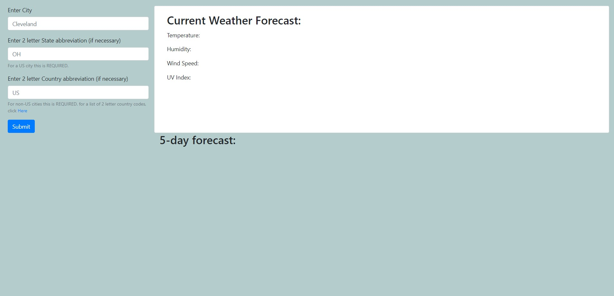
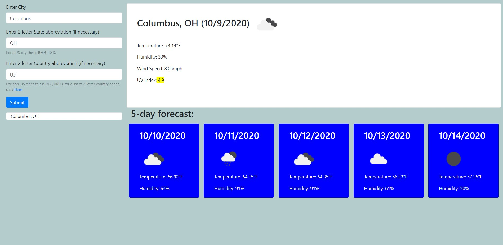

# WeatherDashboard

Homework 6 **weather dashboard**

JSON object for city object courtesy of Openweathermaps

**How does this work?**
the user inputs EITHER:

City + State (within the USA)

-or-

City + Nation (2 letter code)

the combination will be accessed through the citylist JSON object that Openweathermaps uses.

the first AJAX call will access the current weather data, and add to the top card.

the second AJAX call will access the weather data over the span of the next 5 days, and will add cards to underneath the top card.

After each search, the query will be placed in a card underneath the search bar.

these history cards will be clickable, re-searching the place again.

**on refresh, the history will be cleared**

